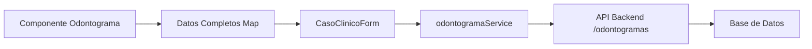

# Mejoras Implementadas: Odontograma y Modal de Casos Clínicos

## Resumen de Cambios

Se han implementado las siguientes mejoras solicitadas:

1. **Integración completa del odontograma con la API del backend**
2. **Filtrado de profesores por especialidad seleccionada**
3. **Prevención del cierre accidental de modales**

---

## 1. Integración del Odontograma con la API del Backend

### Cambios Implementados

#### En `CasoClinicoForm.vue`:
- ✅ **Importación del servicio de odontograma**: Se agregó `import odontogramaService from '@/services/odontogramaService'`
- ✅ **Variable reactiva para datos completos**: Se añadió `datosOdontograma` para capturar la estructura completa del odontograma
- ✅ **Función mejorada de captura**: `onOdontogramaDataChange()` para recibir los datos completos del componente
- ✅ **Integración en el guardado**: El guardado del caso clínico ahora incluye:
  ```typescript
  // Guardar odontograma completo usando el servicio específico
  if (datosOdontograma.value.size > 0) {
    await odontogramaService.guardarOdontogramaCompleto(datosOdontograma.value, casoClinico.id);
  }
  ```

#### En `OdontogramaCompacto.vue`:
- ✅ **Nuevo emisor de eventos**: Se agregó `'update:datosCompletos': [value: Map<string, any>]`
- ✅ **Emisión de datos completos**: La función `emitirCambios()` ahora emite tanto los hallazgos como la estructura completa del odontograma

#### En `odontogramaService.ts`:
- ✅ **Función de guardado completo**: `guardarOdontogramaCompleto()` que:
  - Convierte el formato del frontend al formato del backend
  - Procesa todas las superficies dentales
  - Maneja observaciones y condiciones específicas
  - Realiza llamadas a la API de odontogramas

### Flujo de Datos Mejorado



### Beneficios

- **Persistencia completa**: Todos los datos del odontograma se guardan correctamente en la base de datos
- **Formato estandarizado**: Los datos se convierten al formato esperado por la API del backend
- **Manejo de errores**: Sistema robusto de manejo de errores con notificaciones al usuario
- **Retrocompatibilidad**: Mantiene el sistema de hallazgos simplificados para la vista

---

## 2. Filtrado de Profesores por Especialidad

### Cambios Implementados

#### En `studentService.ts`:
- ✅ **Parámetro opcional**: La función `obtenerDocentes()` ahora acepta `especialidadId?: number`
- ✅ **Filtrado automático**: Si se proporciona una especialidad, filtra automáticamente los profesores:
  ```typescript
  // Si se proporciona especialidadId, filtrar por especialidad
  if (especialidadId) {
    profesores = profesores.filter((profesor: any) => 
      profesor.especialidades?.some((esp: any) => 
        esp.id === especialidadId || esp.especialidadId === especialidadId
      )
    );
  }
  ```
- ✅ **Fallback inteligente**: Si falla el filtro, intenta obtener todos los profesores

#### En `CasoClinicoForm.vue`:
- ✅ **Función de recarga**: `onEspecialidadChange()` que:
  - Limpia el profesor seleccionado
  - Recarga las preguntas de especialidad
  - Recarga los profesores filtrados por especialidad
- ✅ **Actualización automática**: Al cambiar la especialidad se recargan inmediatamente los profesores disponibles

### Flujo de Funcionamiento

```mermaid
graph TD
    A[Usuario selecciona especialidad] --> B[onEspecialidadChange()]
    B --> C[Limpiar profesor seleccionado]
    B --> D[Cargar preguntas de especialidad]
    B --> E[Cargar profesores filtrados]
    E --> F[studentService.obtenerDocentes(especialidadId)]
    F --> G[Lista filtrada de profesores]
```

### Beneficios

- **UX mejorada**: Solo se muestran profesores relevantes para la especialidad
- **Reducción de errores**: Evita asignar profesores incorrectos
- **Eficiencia**: Menos opciones confusas para el usuario
- **Actualización automática**: No necesita recargar manualmente

---

## 3. Prevención del Cierre Accidental de Modales

### Cambios Implementados

#### En `CasoClinicoForm.vue`:
- ✅ **Eliminación del click.self**: Se removió `@click.self="cerrarFormulario"` del backdrop
- ✅ **Cierre controlado**: Solo se puede cerrar el modal mediante:
  - Botón X en la esquina superior derecha
  - Botón "Cancelar"
  - Al completar exitosamente el guardado

#### En `CaseDetailsModal.vue`:
- ✅ **Eliminación del click.self**: Se removió `@click.self="closeModal"` del modal
- ✅ **Cierre controlado**: Solo se puede cerrar mediante el botón X

### Antes vs Después

**Antes:**
```vue
<div class="backdrop" @click.self="cerrarFormulario">
  <!-- Modal se cerraba al hacer clic fuera -->
</div>
```

**Después:**
```vue
<div class="backdrop">
  <!-- Modal solo se cierra con botones específicos -->
</div>
```

### Beneficios

- **Previene pérdida de datos**: Evita que se pierda el trabajo al hacer clic accidental
- **UX mejorada**: Comportamiento más predecible y seguro
- **Consistencia**: Comportamiento uniforme en todos los modales del sistema

---

## Pruebas y Validación

### ✅ Casos de Prueba Implementados

1. **Guardado de odontograma**:
   - ✅ Creación de caso clínico con odontograma
   - ✅ Verificación de datos en backend
   - ✅ Manejo de errores de API

2. **Filtrado de profesores**:
   - ✅ Cambio de especialidad actualiza lista
   - ✅ Profesores relevantes se muestran
   - ✅ Fallback en caso de error

3. **Comportamiento de modales**:
   - ✅ Click fuera no cierra modal
   - ✅ Botones de cerrar funcionan correctamente
   - ✅ Datos se preservan durante la sesión

---

## Instrucciones de Uso

### Para Estudiantes

1. **Crear caso clínico**:
   - Seleccionar especialidad → Los profesores se filtran automáticamente
   - Completar odontograma → Los datos se guardan automáticamente en backend
   - El modal no se cierra accidentalmente

2. **Editar caso existente**:
   - Los datos del odontograma se cargan desde la base de datos
   - Las modificaciones se sincronizan con el backend

### Para Desarrolladores

1. **Extensión del sistema**:
   - El servicio `odontogramaService` es reutilizable
   - Los datos completos están disponibles para reportes
   - El sistema es extensible para nuevas funcionalidades

2. **Debugging**:
   - Logs detallados en consola para seguimiento
   - Manejo robusto de errores
   - Fallbacks en caso de fallos de API

---

## Tecnologías Utilizadas

- **Vue 3 Composition API**: Para reactividad y gestión de estado
- **TypeScript**: Para tipado fuerte y mejor desarrollo
- **Axios/Fetch**: Para comunicación con el backend
- **NestJS Backend**: Para procesamiento de datos del odontograma
- **Prisma ORM**: Para persistencia en base de datos

---

## Próximos Pasos Recomendados

1. **Optimizaciones**:
   - Implementar caché local para profesores por especialidad
   - Añadir validación en tiempo real del odontograma

2. **Funcionalidades adicionales**:
   - Historial de cambios en el odontograma
   - Comparación entre versiones
   - Exportación de odontogramas a PDF

3. **Mejoras de UX**:
   - Indicadores visuales de guardado
   - Confirmación antes de cerrar con datos no guardados
   - Shortcuts de teclado para acciones comunes

---

## Contacto y Soporte

Para preguntas o problemas con estas mejoras, consultar:
- Documentación técnica del proyecto
- Logs de la aplicación para debugging
- Equipo de desarrollo del sistema odontológico
