# Diagrama Causa-Efecto: Gestión de Prácticas Odontológicas Facultad

```mermaid
graph TB
    %% Nodo Principal
    OBJETIVO[🎯 GESTIÓN EXITOSA DE PRÁCTICAS ODONTOLÓGICAS]
    
    %% Categorías Principales
    ESTUDIANTES[👨‍🎓 ESTUDIANTES]
    PROFESORES[👨‍🏫 PROFESORES]
    PACIENTES[🏥 PACIENTES]
    CLINICAS[🏢 CLÍNICAS]
    ACADEMICO[📚 ACADÉMICO]
    TECNOLOGIA[💻 TECNOLOGÍA]

    %% === GESTIÓN DE ESTUDIANTES ===
    ESTUDIANTES --> EST_REGISTRO[📝 Registro]
    ESTUDIANTES --> EST_HORARIOS[⏰ Horarios]
    ESTUDIANTES --> EST_SOLICITUDES[📋 Solicitudes]
    ESTUDIANTES --> EST_EVALUACION[📊 Evaluación]
    
    %% === GESTIÓN DE PROFESORES ===
    PROFESORES --> PROF_SUPERVISION[👁️ Supervisión]
    PROFESORES --> PROF_EVALUACION[📈 Evaluación]
    PROFESORES --> PROF_HORARIOS[📅 Horarios]
    PROFESORES --> PROF_DESARROLLO[🎯 Desarrollo]
    
    %% === GESTIÓN DE PACIENTES ===
    PACIENTES --> PAC_REGISTRO[📋 Registro]
    PACIENTES --> PAC_HISTORIAS[📄 Historias Clínicas]
    PACIENTES --> PAC_TRATAMIENTOS[🦷 Tratamientos]
    PACIENTES --> PAC_SATISFACCION[😊 Satisfacción]
    
    %% === GESTIÓN DE CLÍNICAS ===
    CLINICAS --> CLI_INFRAESTRUCTURA[🏗️ Infraestructura]
    CLINICAS --> CLI_EQUIPAMIENTO[⚕️ Equipamiento]
    CLINICAS --> CLI_PERSONAL[👥 Personal]
    CLINICAS --> CLI_HORARIOS[🕐 Horarios]
    
    %% === GESTIÓN ACADÉMICA ===
    ACADEMICO --> ACA_CURRICULO[📖 Currículo]
    ACADEMICO --> ACA_PLANIFICACION[📋 Planificación]
    ACADEMICO --> ACA_EVALUACION[📊 Evaluación]
    ACADEMICO --> ACA_CALIDAD[⭐ Calidad]
    
    %% === PLATAFORMA TECNOLÓGICA ===
    TECNOLOGIA --> TEC_SISTEMA[💾 Sistema]
    TECNOLOGIA --> TEC_SEGURIDAD[🔒 Seguridad]
    TECNOLOGIA --> TEC_INTEGRACION[🔗 Integración]
    TECNOLOGIA --> TEC_USABILIDAD[👤 Usabilidad]

    %% === FACTORES TRANSVERSALES ===
    COMUNICACION[📢 COMUNICACIÓN]
    RECURSOS[💰 RECURSOS]
    NORMATIVAS[📜 NORMATIVAS]
    CULTURA[🤝 CULTURA]

    %% Conexiones hacia el objetivo principal
    EST_EVALUACION --> OBJETIVO
    PROF_DESARROLLO --> OBJETIVO
    PAC_SATISFACCION --> OBJETIVO
    CLI_HORARIOS --> OBJETIVO
    ACA_CALIDAD --> OBJETIVO
    TEC_USABILIDAD --> OBJETIVO
    COMUNICACION --> OBJETIVO
    RECURSOS --> OBJETIVO
    NORMATIVAS --> OBJETIVO
    CULTURA --> OBJETIVO

    %% Estilos
    classDef objetivoStyle fill:#e1f5fe,stroke:#01579b,stroke-width:4px,color:#000
    classDef categoriaStyle fill:#f3e5f5,stroke:#4a148c,stroke-width:2px,color:#000
    classDef subcategoriaStyle fill:#e8f5e8,stroke:#1b5e20,stroke-width:2px,color:#000
    classDef transversalStyle fill:#fce4ec,stroke:#880e4f,stroke-width:2px,color:#000

    class OBJETIVO objetivoStyle
    class ESTUDIANTES,PROFESORES,PACIENTES,CLINICAS,ACADEMICO,TECNOLOGIA categoriaStyle
    class EST_REGISTRO,EST_HORARIOS,EST_SOLICITUDES,EST_EVALUACION,PROF_SUPERVISION,PROF_EVALUACION,PROF_HORARIOS,PROF_DESARROLLO,PAC_REGISTRO,PAC_HISTORIAS,PAC_TRATAMIENTOS,PAC_SATISFACCION,CLI_INFRAESTRUCTURA,CLI_EQUIPAMIENTO,CLI_PERSONAL,CLI_HORARIOS,ACA_CURRICULO,ACA_PLANIFICACION,ACA_EVALUACION,ACA_CALIDAD,TEC_SISTEMA,TEC_SEGURIDAD,TEC_INTEGRACION,TEC_USABILIDAD subcategoriaStyle
    class COMUNICACION,RECURSOS,NORMATIVAS,CULTURA transversalStyle
```

## 🔍 **Análisis Resumido del Diagrama**

### **Objetivo Principal:**
> **Gestión Exitosa de Prácticas Odontológicas** - Formación integral, calidad clínica y cumplimiento académico.

### **6 Categorías Clave:**

#### 1. **👨‍🎓 Estudiantes** - Registro, Horarios, Solicitudes, Evaluación
#### 2. **👨‍🏫 Profesores** - Supervisión, Evaluación, Horarios, Desarrollo  
#### 3. **🏥 Pacientes** - Registro, Historias, Tratamientos, Satisfacción
#### 4. **🏢 Clínicas** - Infraestructura, Equipamiento, Personal, Horarios
#### 5. **📚 Académico** - Currículo, Planificación, Evaluación, Calidad
#### 6. **💻 Tecnología** - Sistema, Seguridad, Integración, Usabilidad

### **4 Factores Transversales:**
- **📢 Comunicación** - Canales efectivos entre todos los actores
- **💰 Recursos** - Presupuesto y sostenibilidad financiera  
- **📜 Normativas** - Marco legal y protocolos vigentes
- **🤝 Cultura** - Compromiso y trabajo en equipo institucional

**Este diagrama muestra la interrelación de todos los factores que impactan el éxito de las prácticas odontológicas en la facultad.**
