# Diagrama Causa-Efecto: Gestión de Prácticas Odontológicas Facultad

```mermaid
graph TB
    %% Nodo Principal
    OBJETIVO[🎯 GESTIÓN EXITOSA DE PRÁCTICAS ODONTOLÓGICAS<br/>🎓 Formación integral de estudiantes<br/>📊 Calidad en atención clínica<br/>✅ Cumplimiento académico]
    
    %% Categorías Principales
    ESTUDIANTES[👨‍🎓 GESTIÓN DE ESTUDIANTES]
    PROFESORES[👨‍🏫 GESTIÓN DE PROFESORES]
    PACIENTES[🏥 GESTIÓN DE PACIENTES]
    CLINICAS[🏢 GESTIÓN DE CLÍNICAS]
    ACADEMICO[📚 GESTIÓN ACADÉMICA]
    TECNOLOGIA[💻 PLATAFORMA TECNOLÓGICA]

    %% === GESTIÓN DE ESTUDIANTES ===
    ESTUDIANTES --> EST_REGISTRO[📝 Registro y Matrícula]
    ESTUDIANTES --> EST_HORARIOS[⏰ Gestión de Horarios]
    ESTUDIANTES --> EST_SOLICITUDES[📋 Solicitudes de Práctica]
    ESTUDIANTES --> EST_CASOS[📁 Casos Clínicos Asignados]
    ESTUDIANTES --> EST_EVALUACION[📊 Evaluación y Seguimiento]
    
    EST_REGISTRO --> EST_REG_DATOS[• Datos personales completos<br/>• Documentación válida<br/>• Especialidades de interés<br/>• Historial académico]
    EST_HORARIOS --> EST_HOR_DISP[• Disponibilidad de tiempo<br/>• Compatibilidad con horarios clínica<br/>• Flexibilidad para reprogramación<br/>• Distribución equitativa]
    EST_SOLICITUDES --> EST_SOL_PROC[• Solicitudes prioritarias<br/>• Solicitudes masivas<br/>• Validación de requisitos<br/>• Asignación docente]
    EST_CASOS --> EST_CAS_GEST[• Asignación de pacientes<br/>• Seguimiento de tratamientos<br/>• Documentación clínica<br/>• Resultados de práctica]
    EST_EVALUACION --> EST_EVA_CRIT[• Evaluación continua<br/>• Retroalimentación docente<br/>• Autoevaluación<br/>• Calificaciones finales]

    %% === GESTIÓN DE PROFESORES ===
    PROFESORES --> PROF_SUPERVISION[👁️ Supervisión Clínica]
    PROFESORES --> PROF_EVALUACION[📈 Evaluación Estudiantes]
    PROFESORES --> PROF_HORARIOS[📅 Gestión de Horarios]
    PROFESORES --> PROF_RECURSOS[📚 Recursos Didácticos]
    PROFESORES --> PROF_DESARROLLO[🎯 Desarrollo Profesional]
    
    PROF_SUPERVISION --> PROF_SUP_ACT[• Supervisión directa en clínica<br/>• Revisión de casos clínicos<br/>• Corrección de procedimientos<br/>• Orientación técnica]
    PROF_EVALUACION --> PROF_EVA_MET[• Criterios estandarizados<br/>• Rúbricas de evaluación<br/>• Seguimiento individual<br/>• Reportes de progreso]
    PROF_HORARIOS --> PROF_HOR_COOR[• Coordinación con clínicas<br/>• Disponibilidad para consultas<br/>• Horarios de supervisión<br/>• Flexibilidad de tiempo]
    PROF_RECURSOS --> PROF_REC_MAT[• Material didáctico actualizado<br/>• Protocolos clínicos<br/>• Base de casos de estudio<br/>• Herramientas de evaluación]
    PROF_DESARROLLO --> PROF_DES_FORM[• Capacitación continua<br/>• Actualización técnica<br/>• Metodologías pedagógicas<br/>• Investigación aplicada]

    %% === GESTIÓN DE PACIENTES ===
    PACIENTES --> PAC_REGISTRO[📋 Registro y Admisión]
    PACIENTES --> PAC_HISTORIAS[📄 Historias Clínicas]
    PACIENTES --> PAC_TRATAMIENTOS[🦷 Tratamientos]
    PACIENTES --> PAC_SEGUIMIENTO[🔄 Seguimiento]
    PACIENTES --> PAC_SATISFACCION[😊 Satisfacción]
    
    PAC_REGISTRO --> PAC_REG_PROC[• Datos demográficos<br/>• Consentimientos informados<br/>• Encuestas de tamizaje<br/>• Asignación a estudiantes]
    PAC_HISTORIAS --> PAC_HIS_GEST[• Historia clínica completa<br/>• Odontogramas digitales<br/>• Hallazgos clínicos<br/>• Documentación fotográfica]
    PAC_TRATAMIENTOS --> PAC_TRA_PLAN[• Planes de tratamiento<br/>• Procedimientos realizados<br/>• Prescripciones médicas<br/>• Control de calidad]
    PAC_SEGUIMIENTO --> PAC_SEG_CONT[• Citas de control<br/>• Evolución del tratamiento<br/>• Observaciones clínicas<br/>• Comunicación con familia]
    PAC_SATISFACCION --> PAC_SAT_MED[• Encuestas de satisfacción<br/>• Retroalimentación de servicio<br/>• Quejas y sugerencias<br/>• Mejora continua]

    %% === GESTIÓN DE CLÍNICAS ===
    CLINICAS --> CLI_INFRAESTRUCTURA[🏗️ Infraestructura]
    CLINICAS --> CLI_EQUIPAMIENTO[⚕️ Equipamiento]
    CLINICAS --> CLI_PERSONAL[👥 Personal de Apoyo]
    CLINICAS --> CLI_HORARIOS[🕐 Horarios Operativos]
    CLINICAS --> CLI_MANTENIMIENTO[🔧 Mantenimiento]
    
    CLI_INFRAESTRUCTURA --> CLI_INF_ESP[• Espacios adecuados<br/>• Consultoritos funcionales<br/>• Áreas de esterilización<br/>• Salas de espera]
    CLI_EQUIPAMIENTO --> CLI_EQU_DISP[• Equipos odontológicos<br/>• Instrumental esterilizado<br/>• Materiales de consumo<br/>• Tecnología actualizada]
    CLI_PERSONAL --> CLI_PER_CALIF[• Personal auxiliar calificado<br/>• Técnicos especializados<br/>• Personal administrativo<br/>• Coordinadores clínicos]
    CLI_HORARIOS --> CLI_HOR_ORG[• Horarios de atención<br/>• Distribución de espacios<br/>• Programación de citas<br/>• Optimización de recursos]
    CLI_MANTENIMIENTO --> CLI_MAN_PREV[• Mantenimiento preventivo<br/>• Calibración de equipos<br/>• Limpieza y desinfección<br/>• Reposición de materiales]

    %% === GESTIÓN ACADÉMICA ===
    ACADEMICO --> ACA_CURRICULO[📖 Currículo]
    ACADEMICO --> ACA_PLANIFICACION[📋 Planificación]
    ACADEMICO --> ACA_EVALUACION[📊 Sistema de Evaluación]
    ACADEMICO --> ACA_COMPETENCIAS[🎯 Competencias]
    ACADEMICO --> ACA_CALIDAD[⭐ Aseguramiento de Calidad]
    
    ACA_CURRICULO --> ACA_CUR_CONT[• Contenidos actualizados<br/>• Objetivos de aprendizaje<br/>• Metodologías activas<br/>• Integración teórico-práctica]
    ACA_PLANIFICACION --> ACA_PLA_ORG[• Cronograma académico<br/>• Distribución de prácticas<br/>• Coordinación interdisciplinaria<br/>• Recursos necesarios]
    ACA_EVALUACION --> ACA_EVA_SIS[• Criterios claros<br/>• Instrumentos validados<br/>• Evaluación formativa<br/>• Retroalimentación oportuna]
    ACA_COMPETENCIAS --> ACA_COM_DES[• Competencias específicas<br/>• Habilidades clínicas<br/>• Valores profesionales<br/>• Pensamiento crítico]
    ACA_CALIDAD --> ACA_CAL_MEJ[• Estándares de calidad<br/>• Mejora continua<br/>• Acreditación externa<br/>• Indicadores de desempeño]

    %% === PLATAFORMA TECNOLÓGICA ===
    TECNOLOGIA --> TEC_SISTEMA[💾 Sistema de Información]
    TECNOLOGIA --> TEC_SEGURIDAD[🔒 Seguridad]
    TECNOLOGIA --> TEC_INTEGRACION[🔗 Integración]
    TECNOLOGIA --> TEC_USABILIDAD[👤 Usabilidad]
    TECNOLOGIA --> TEC_SOPORTE[🛠️ Soporte Técnico]
    
    TEC_SISTEMA --> TEC_SIS_FUNC[• Gestión de usuarios<br/>• Historias clínicas digitales<br/>• Programación de citas<br/>• Reportes y estadísticas]
    TEC_SEGURIDAD --> TEC_SEG_PROT[• Protección de datos<br/>• Control de acceso<br/>• Auditoría de logs<br/>• Backup y recuperación]
    TEC_INTEGRACION --> TEC_INT_MOD[• Módulos interconectados<br/>• API's funcionales<br/>• Sincronización de datos<br/>• Compatibilidad sistemas]
    TEC_USABILIDAD --> TEC_USA_EXP[• Interfaz intuitiva<br/>• Responsive design<br/>• Capacitación usuarios<br/>• Feedback continuo]
    TEC_SOPORTE --> TEC_SOP_MAN[• Mantenimiento preventivo<br/>• Actualizaciones regulares<br/>• Soporte 24/7<br/>• Documentación técnica]

    %% === FACTORES TRANSVERSALES ===
    COMUNICACION[📢 COMUNICACIÓN EFECTIVA]
    RECURSOS[💰 RECURSOS FINANCIEROS]
    NORMATIVAS[📜 MARCO NORMATIVO]
    CULTURA[🤝 CULTURA ORGANIZACIONAL]
    
    COMUNICACION --> COM_CANALES[• Canales de comunicación<br/>• Información oportuna<br/>• Feedback bidireccional<br/>• Resolución de conflictos]
    RECURSOS --> REC_PRESUPUESTO[• Presupuesto adecuado<br/>• Inversión en tecnología<br/>• Recursos humanos<br/>• Sostenibilidad financiera]
    NORMATIVAS --> NOR_CUMPLIMIENTO[• Normativas sanitarias<br/>• Regulaciones académicas<br/>• Protocolos de bioseguridad<br/>• Marco legal vigente]
    CULTURA --> CUL_VALORES[• Compromiso institucional<br/>• Trabajo en equipo<br/>• Orientación al paciente<br/>• Excelencia académica]

    %% Conexiones hacia el objetivo principal
    EST_EVALUACION --> OBJETIVO
    PROF_DESARROLLO --> OBJETIVO
    PAC_SATISFACCION --> OBJETIVO
    CLI_MANTENIMIENTO --> OBJETIVO
    ACA_CALIDAD --> OBJETIVO
    TEC_SOPORTE --> OBJETIVO
    COM_CANALES --> OBJETIVO
    REC_PRESUPUESTO --> OBJETIVO
    NOR_CUMPLIMIENTO --> OBJETIVO
    CUL_VALORES --> OBJETIVO

    %% Estilos
    classDef objetivoStyle fill:#e1f5fe,stroke:#01579b,stroke-width:4px,color:#000
    classDef categoriaStyle fill:#f3e5f5,stroke:#4a148c,stroke-width:2px,color:#000
    classDef subcategoriaStyle fill:#e8f5e8,stroke:#1b5e20,stroke-width:2px,color:#000
    classDef detalleStyle fill:#fff8e1,stroke:#e65100,stroke-width:1px,color:#000
    classDef transversalStyle fill:#fce4ec,stroke:#880e4f,stroke-width:2px,color:#000

    class OBJETIVO objetivoStyle
    class ESTUDIANTES,PROFESORES,PACIENTES,CLINICAS,ACADEMICO,TECNOLOGIA categoriaStyle
    class EST_REGISTRO,EST_HORARIOS,EST_SOLICITUDES,EST_CASOS,EST_EVALUACION,PROF_SUPERVISION,PROF_EVALUACION,PROF_HORARIOS,PROF_RECURSOS,PROF_DESARROLLO,PAC_REGISTRO,PAC_HISTORIAS,PAC_TRATAMIENTOS,PAC_SEGUIMIENTO,PAC_SATISFACCION,CLI_INFRAESTRUCTURA,CLI_EQUIPAMIENTO,CLI_PERSONAL,CLI_HORARIOS,CLI_MANTENIMIENTO,ACA_CURRICULO,ACA_PLANIFICACION,ACA_EVALUACION,ACA_COMPETENCIAS,ACA_CALIDAD,TEC_SISTEMA,TEC_SEGURIDAD,TEC_INTEGRACION,TEC_USABILIDAD,TEC_SOPORTE subcategoriaStyle
    class COMUNICACION,RECURSOS,NORMATIVAS,CULTURA transversalStyle
```

## 🔍 **Análisis del Diagrama Causa-Efecto**

### **Objetivo Principal:**
> **Gestión Exitosa de Prácticas Odontológicas** que garantice formación integral de estudiantes, calidad en atención clínica y cumplimiento académico.

### **Categorías Principales:**

#### 1. **👨‍🎓 Gestión de Estudiantes**
- **Registro y Matrícula**: Base de datos completa y actualizada
- **Horarios**: Coordinación efectiva con clínicas y profesores  
- **Solicitudes**: Sistema ágil para asignación de prácticas
- **Casos Clínicos**: Seguimiento integral de tratamientos
- **Evaluación**: Retroalimentación continua y mejora

#### 2. **👨‍🏫 Gestión de Profesores**
- **Supervisión**: Acompañamiento directo en clínica
- **Evaluación**: Criterios claros y justos
- **Horarios**: Disponibilidad coordinada
- **Recursos**: Material didáctico actualizado
- **Desarrollo**: Capacitación continua

#### 3. **🏥 Gestión de Pacientes**
- **Registro**: Proceso eficiente de admisión
- **Historias Clínicas**: Documentación completa
- **Tratamientos**: Calidad en atención
- **Seguimiento**: Continuidad en cuidados
- **Satisfacción**: Retroalimentación del servicio

#### 4. **🏢 Gestión de Clínicas**
- **Infraestructura**: Espacios adecuados
- **Equipamiento**: Tecnología actualizada
- **Personal**: Apoyo calificado
- **Horarios**: Optimización de recursos
- **Mantenimiento**: Operación continua

#### 5. **📚 Gestión Académica**
- **Currículo**: Contenidos actualizados
- **Planificación**: Organización efectiva
- **Evaluación**: Sistema integral
- **Competencias**: Desarrollo profesional
- **Calidad**: Mejora continua

#### 6. **💻 Plataforma Tecnológica**
- **Sistema**: Funcionalidades integrales
- **Seguridad**: Protección de datos
- **Integración**: Módulos conectados
- **Usabilidad**: Experiencia del usuario
- **Soporte**: Mantenimiento continuo

### **Factores Transversales:**
- **📢 Comunicación Efectiva**
- **💰 Recursos Financieros**
- **📜 Marco Normativo**
- **🤝 Cultura Organizacional**

Este diagrama proporciona una visión integral de todos los factores que influyen en el éxito de la gestión de prácticas odontológicas en la facultad.
