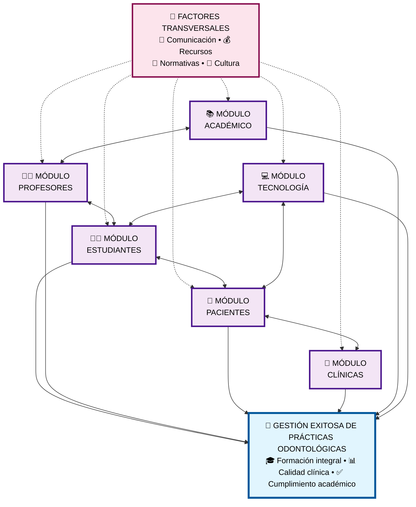

# Diagrama Integrador: Visión Completa del Sistema

## 🎯 **Resumen del Sistema Integrado**

### **7 Módulos Interconectados:**

| **Módulo** | **Enfoque Principal** | **Impacto Clave** |
|------------|---------------------|-------------------|
| **👨‍🎓 Estudiantes** | Formación y evaluación | Aprendizaje efectivo |
| **👨‍🏫 Profesores** | Supervisión y desarrollo | Calidad docente |
| **🏥 Pacientes** | Atención y satisfacción | Casos clínicos reales |
| **🏢 Clínicas** | Infraestructura y recursos | Ambiente de práctica |
| **📚 Académico** | Currículo y estándares | Marco educativo |
| **💻 Tecnología** | Sistemas y herramientas | Soporte digital |
| **🔄 Transversales** | Factores sistémicos | Integración global |

### **Relaciones Clave:**
- **Directas**: Cada módulo contribuye al objetivo principal
- **Transversales**: Los factores sistémicos impactan todos los módulos  
- **Intermodulares**: Conexiones bidireccionales entre módulos relacionados

### **Uso en Documento:**
Cada módulo (1-7) puede insertarse como **imagen individual** en tu documento de Word, facilitando la lectura y comprensión por secciones.
