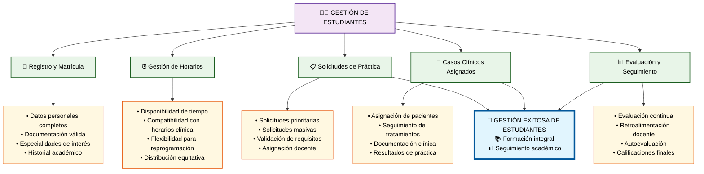

# Módulo 1: Gestión de Estudiantes

## 📝 **Aspectos Clave del Módulo:**

### **Elementos Críticos:**
- **Registro completo** con documentación validada
- **Coordinación de horarios** entre estudiantes y clínicas
- **Sistema ágil** para solicitudes de práctica
- **Seguimiento integral** de casos clínicos asignados
- **Evaluación continua** con retroalimentación efectiva

### **Impacto en el Objetivo:**
La gestión efectiva de estudiantes es fundamental para garantizar una formación integral y el cumplimiento de los objetivos académicos en las prácticas odontológicas.
