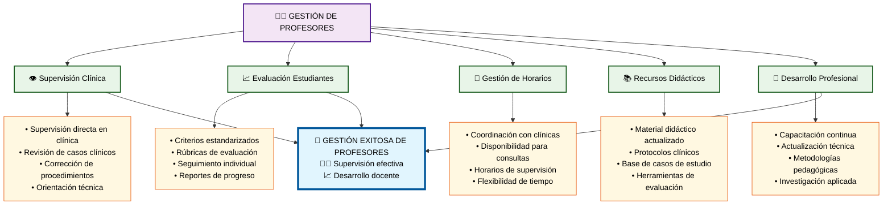

# Módulo 2: Gestión de Profesores

## 👨‍🏫 **Aspectos Clave del Módulo:**

### **Elementos Críticos:**
- **Supervisión directa** en clínica con orientación técnica
- **Evaluación estandarizada** con criterios claros
- **Coordinación efectiva** de horarios y disponibilidad
- **Recursos actualizados** y herramientas pedagógicas
- **Desarrollo profesional continuo** y capacitación

### **Impacto en el Objetivo:**
Los profesores son el pilar fundamental en la formación clínica, su gestión efectiva garantiza la calidad educativa y el desarrollo de competencias en los estudiantes.
