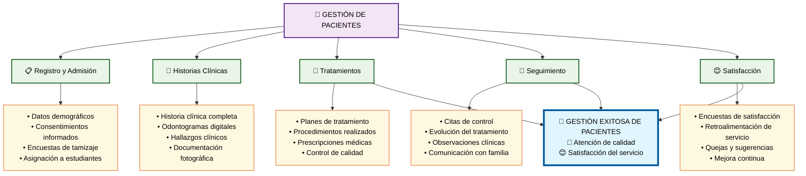

# Módulo 3: Gestión de Pacientes

## 🏥 **Aspectos Clave del Módulo:**

### **Elementos Críticos:**
- **Registro completo** con consentimientos informados
- **Historias clínicas digitales** con documentación integral
- **Planes de tratamiento** con control de calidad
- **Seguimiento continuo** y comunicación efectiva
- **Medición de satisfacción** para mejora continua

### **Impacto en el Objetivo:**
La gestión efectiva de pacientes asegura la calidad en la atención clínica y proporciona casos reales valiosos para el aprendizaje estudiantil.
