# Módulo 4: Gestión de Clínicas

```mermaid
graph TB
    %% Nodo Principal del Módulo
    OBJETIVO_CLI[🎯 GESTIÓN EXITOSA DE CLÍNICAS<br/>🏢 Infraestructura óptima<br/>⚕️ Equipamiento funcional]
    
    %% Categoría Principal
    CLINICAS[🏢 GESTIÓN DE CLÍNICAS]

    %% === GESTIÓN DE CLÍNICAS ===
    CLINICAS --> CLI_INFRAESTRUCTURA[🏗️ Infraestructura]
    CLINICAS --> CLI_EQUIPAMIENTO[⚕️ Equipamiento]
    CLINICAS --> CLI_PERSONAL[👥 Personal de Apoyo]
    CLINICAS --> CLI_HORARIOS[🕐 Horarios Operativos]
    CLINICAS --> CLI_MANTENIMIENTO[🔧 Mantenimiento]
    
    CLI_INFRAESTRUCTURA --> CLI_INF_ESP[• Espacios adecuados<br/>• Consultoritos funcionales<br/>• Áreas de esterilización<br/>• Salas de espera]
    CLI_EQUIPAMIENTO --> CLI_EQU_DISP[• Equipos odontológicos<br/>• Instrumental esterilizado<br/>• Materiales de consumo<br/>• Tecnología actualizada]
    CLI_PERSONAL --> CLI_PER_CALIF[• Personal auxiliar calificado<br/>• Técnicos especializados<br/>• Personal administrativo<br/>• Coordinadores clínicos]
    CLI_HORARIOS --> CLI_HOR_ORG[• Horarios de atención<br/>• Distribución de espacios<br/>• Programación de citas<br/>• Optimización de recursos]
    CLI_MANTENIMIENTO --> CLI_MAN_PREV[• Mantenimiento preventivo<br/>• Calibración de equipos<br/>• Limpieza y desinfección<br/>• Reposición de materiales]

    %% Conexión al objetivo
    CLI_MANTENIMIENTO --> OBJETIVO_CLI
    CLI_EQUIPAMIENTO --> OBJETIVO_CLI
    CLI_INFRAESTRUCTURA --> OBJETIVO_CLI

    %% Estilos
    classDef objetivoStyle fill:#e1f5fe,stroke:#01579b,stroke-width:4px,color:#000
    classDef categoriaStyle fill:#f3e5f5,stroke:#4a148c,stroke-width:2px,color:#000
    classDef subcategoriaStyle fill:#e8f5e8,stroke:#1b5e20,stroke-width:2px,color:#000
    classDef detalleStyle fill:#fff8e1,stroke:#e65100,stroke-width:1px,color:#000

    class OBJETIVO_CLI objetivoStyle
    class CLINICAS categoriaStyle
    class CLI_INFRAESTRUCTURA,CLI_EQUIPAMIENTO,CLI_PERSONAL,CLI_HORARIOS,CLI_MANTENIMIENTO subcategoriaStyle
    class CLI_INF_ESP,CLI_EQU_DISP,CLI_PER_CALIF,CLI_HOR_ORG,CLI_MAN_PREV detalleStyle
```

## 🏢 **Aspectos Clave del Módulo:**

### **Elementos Críticos:**
- **Infraestructura adecuada** con espacios funcionales
- **Equipamiento actualizado** y materiales disponibles
- **Personal calificado** de apoyo técnico y administrativo
- **Optimización de horarios** y recursos disponibles
- **Mantenimiento preventivo** para operación continua

### **Impacto en el Objetivo:**
La gestión efectiva de clínicas proporciona el ambiente físico y técnico necesario para realizar prácticas odontológicas de calidad.
