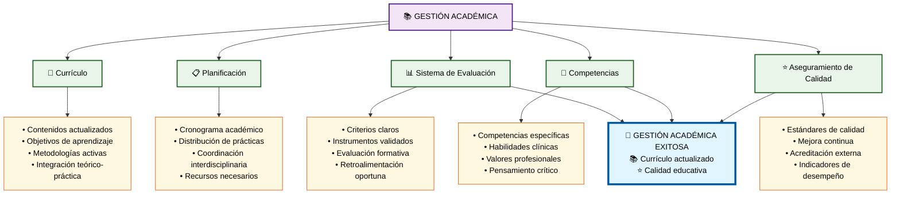

# Módulo 5: Gestión Académica

## 📚 **Aspectos Clave del Módulo:**

### **Elementos Críticos:**
- **Currículo actualizado** con metodologías activas
- **Planificación académica** coordinada y organizada
- **Sistema de evaluación** con criterios claros y validados
- **Desarrollo de competencias** clínicas y profesionales
- **Aseguramiento de calidad** con mejora continua

### **Impacto en el Objetivo:**
La gestión académica establece los fundamentos educativos y los estándares de calidad para el éxito de las prácticas odontológicas.
