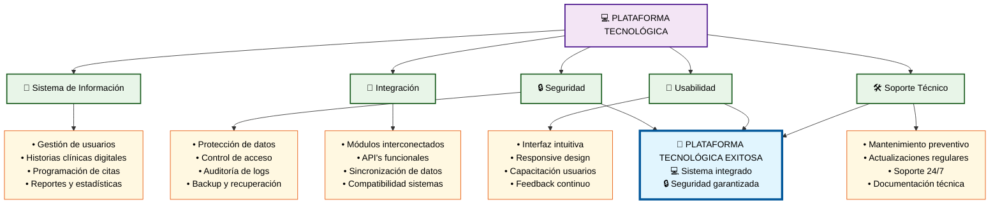

# Módulo 6: Plataforma Tecnológica

## 💻 **Aspectos Clave del Módulo:**

### **Elementos Críticos:**
- **Sistema integral** con gestión completa de usuarios y datos
- **Seguridad robusta** con protección y control de acceso
- **Integración modular** con APIs funcionales
- **Usabilidad óptima** con interfaz intuitiva
- **Soporte técnico continuo** con mantenimiento preventivo

### **Impacto en el Objetivo:**
La plataforma tecnológica es el soporte digital que habilita y optimiza todos los procesos de gestión de las prácticas odontológicas.
