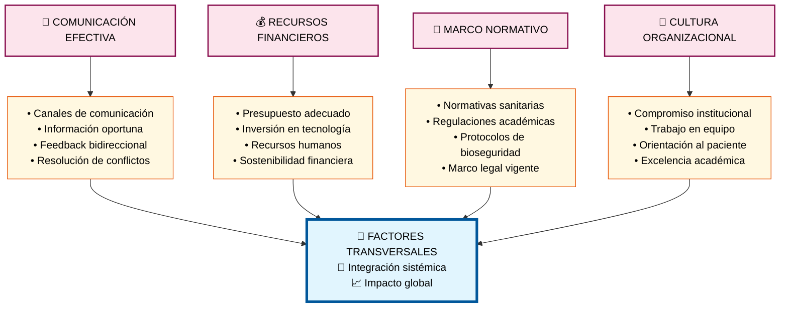

# Módulo 7: Factores Transversales

## 🔄 **Aspectos Clave del Módulo:**

### **Elementos Críticos:**
- **Comunicación efectiva** con canales claros y feedback bidireccional
- **Recursos financieros** suficientes y sostenibles
- **Marco normativo** actualizado y cumplimiento legal
- **Cultura organizacional** orientada a la excelencia

### **Impacto Transversal:**
Estos factores afectan **TODOS** los módulos anteriores:
- ✅ **Estudiantes** - Comunicación clara, recursos para becas, normativas académicas
- ✅ **Profesores** - Presupuesto para capacitación, cultura de excelencia docente  
- ✅ **Pacientes** - Protocolos de atención, comunicación efectiva
- ✅ **Clínicas** - Inversión en infraestructura, normativas sanitarias
- ✅ **Académico** - Recursos curriculares, regulaciones educativas
- ✅ **Tecnología** - Presupuesto para sistemas, cultura de innovación

### **Efecto Multiplicador:**
La fortaleza en estos factores transversales **amplifica** el éxito de todos los demás módulos, mientras que su debilidad puede **limitar** el potencial de la gestión integral.
